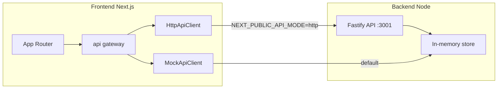

# Backend integration plan

## Current state

- **Frontend**: Next.js App Router at repo root ([src/app/](src/app/), [package.json](package.json)). Data goes through a single gateway ([src/lib/api/index.ts](src/lib/api/index.ts)) with two implementations:
  - **MockApiClient** (default): in-memory, [src/lib/api/mock/mockClient.ts](src/lib/api/mock/mockClient.ts) (~949 lines), seeded via [mockDb](src/lib/api/mock/mockDb.ts) + [seed](src/lib/api/mock/seed.ts).
  - **HttpApiClient**: REST client pointing at `NEXT_PUBLIC_API_BASE_URL` (default `http://localhost:3001`). Activated when `NEXT_PUBLIC_API_MODE=http`.
- **API contract**: [README](README.md) and [src/lib/api/http/httpClient.ts](src/lib/api/http/httpClient.ts) define ~58 endpoints (auth, users, services, rooms, availability, bookingActivations, appointments, credits, billing, invoices, bankTransactions, waitlist, reports, notifications, settings, stats). DTOs and Zod schemas live in [src/lib/contracts/](src/lib/contracts/).
- **apps/api**: placeholder only ([apps/api/index.ts](apps/api/index.ts)). **apps/web**: Next.js with a proxy route to `API_BACKEND_URL` (default 4000); not the main app (main app is at root).
- **No pnpm workspace** today; root is a single package.

## Backend choice and run model

| Decision                       | Choice                                                                                                                 | Rationale                                                                                                          |
| ------------------------------ | ---------------------------------------------------------------------------------------------------------------------- | ------------------------------------------------------------------------------------------------------------------ |
| **Runtime**                    | Node.js                                                                                                                | Matches existing stack; no new runtime.                                                                            |
| **Framework**                  | Fastify                                                                                                                | TypeScript-friendly, fast, built-in schema validation (optional with Zod), CORS plugin.                            |
| **Port**                       | 3001                                                                                                                   | Matches frontend default `NEXT_PUBLIC_API_BASE_URL`.                                                               |
| **Where**                      | `apps/api`                                                                                                             | Keeps API as a separate runnable service; room for workspace later.                                                |
| **Data store (first version)** | In-memory                                                                                                              | Mirror mock DB + seed so backend runs with zero DB setup; same behavior as mock. Later swap to SQLite or Postgres. |
| **Auth**                       | JWT access token in `Authorization: Bearer`                                                                            | Aligns with README; optional refresh token later.                                                                  |
| **How to run**                 | Two processes: Next (e.g. 3000) + API (3001). Single-command option: root script that runs both (e.g. `concurrently`). | Frontend and backend are separate; devs can run `pnpm dev` + `pnpm dev:api` or one `pnpm dev:all`.                 |

## High-level architecture

- **Shared types**: Zod schemas and inferred types used by both frontend and backend. Options: (A) keep contracts only in `src/lib/contracts` and have backend import from root (e.g. path or copy), or (B) introduce `packages/shared`, put contracts there, and have both root and `apps/api` depend on it. **Recommendation: (B)** so the backend is self-contained and both sides validate with the same schemas.

## Implementation plan

### 1. Monorepo and shared package

- Add **pnpm-workspace.yaml** at repo root with packages: `[".", "apps/*", "packages/*"]`.
- **packages/shared**:
  - Add `package.json` (name e.g. `@pristav/shared`, main/types to `dist` or `src`).
  - Copy or re-export from [src/lib/contracts/](src/lib/contracts/) all Zod schemas and types (auth, users, services, rooms, appointments, availability, booking-activation, credits, billing, invoices, bank-transactions, notifications, reports, waitlist, settings, stats). Add dependency: `zod`.
  - Build step: `tsc` so backend and frontend can consume built types (or use `"main": "src/index.ts"` and ts-node/tsx if you prefer no build for shared).
- **Root app**: Add dependency `@pristav/shared`. Option A: Replace `src/lib/contracts` imports with `@pristav/shared` everywhere. Option B: Keep `src/lib/contracts` as re-exports from `@pristav/shared` so minimal file churn. Prefer B for smaller diff.
- **apps/api**: Add `package.json` with dependencies: `fastify`, `@fastify/cors`, `zod`, `@pristav/shared` (workspace). Scripts: `"dev": "tsx watch src/index.ts"`, `"build": "tsc"`, `"start": "node dist/index.js"`. Port from env (default 3001).

### 2. Backend structure (apps/api)

- **Entry**: `src/index.ts` — create Fastify app, register CORS (origin e.g. `http://localhost:3000`), register routes, load in-memory store + seed, listen on PORT.
- **Store**: `src/store.ts` — in-memory maps (users, services, rooms, appointments, credits, billingReports, notifications, therapyReports, waitlist, settings, etc.) mirroring [mockDb](src/lib/api/mock/mockDb.ts). Plus `src/seed.ts` — same deterministic seed as frontend mock (admin, receptionist, therapists, clients, services, rooms, appointments, credits, waitlist, notifications, settings).
- **Auth middleware**: `src/middleware/auth.ts` — read `Authorization: Bearer <token>`, verify JWT (use `JWT_SECRET`), decode payload (userId, role), attach to `request.user`; on missing/invalid return 401 with JSON body.
- **RBAC middleware** (optional but recommended): `src/middleware/rbac.ts` — check `request.user.role` vs route (e.g. PUT /settings only for ADMIN); return 403 if forbidden.
- **Routes** (per domain; all under prefix e.g. none or `/api` if you want `/api/auth/login`):
  - **auth**: `POST /auth/login` (body: email/password or role for dev; validate with Zod; find user; sign JWT; return user + accessToken + expiresIn), `GET /auth/me` (require auth; return user).
  - **users**: `GET /users` (query: role, search, page, limit), `GET /users/:id`, `PUT /users/:id` (body: UserUpdate). All except login/me require auth.
  - **services**: `GET /services`, `GET /services/:id`, `POST /services`, `PUT /services/:id`.
  - **rooms**: same pattern.
  - **availability**: `GET /availability?employeeId=&from=&to=`, `GET /availability/bookable-days?from=&to=` (return slots/days from store or computed from appointments + settings).
  - **booking-activations**: `GET /booking-activations?...`, `POST /booking-activations` (body: BookingActivationSet).
  - **appointments**: `GET /appointments?...`, `GET /appointments/:id`, `POST /appointments` (body: AppointmentCreate; apply credit deduction and PAID/UNPAID logic as in mock), `POST /appointments/blocks` (TherapyBlockCreate), `PUT /appointments/:id`, `POST /appointments/:id/cancel` (body: refund, reason; apply refund logic), `POST /appointments/:id/complete`.
  - **credits**: `GET /credits/:clientId`, `GET /credits/:clientId/transactions`, `POST /credits/:clientId/adjust`.
  - **billing**: `POST /billing/reports` (body: period), `GET /billing/reports/:id`, `GET /billing/reports/:id/export` (CSV string), `POST /billing/reports/mark-invoiced` (body: appointmentIds).
  - **invoices**: list, get, create, update, send, sendBulk, sendOverdueReminders (implement as in mock or stubs).
  - **bank-transactions**: list, sync (stub), match (stub or real logic).
  - **waitlist**: `GET /waitlist`, `POST /waitlist`, `PUT /waitlist/:id`, `GET /waitlist/suggestions?slotStart=&slotEnd=&serviceId=`, `POST /waitlist/:id/notify`.
  - **reports**: `POST /reports/upload` (multipart; store file in memory or disk; return ReportUploadResult), `GET /reports?clientId=`, `GET /reports/:id/download`, `PATCH /reports/:id` (visibleToClient).
  - **notifications**: `GET /notifications?...`, `POST /notifications/send`, `PATCH /notifications/:id/read`.
  - **settings**: `GET /settings`, `PUT /settings` (admin only if RBAC).
  - **stats**: `GET /stats/occupancy?from=&to=`, `GET /stats/cancellations?from=&to=`, `GET /stats/client-tags`.
- **Validation**: For each POST/PUT/PATCH, parse body (and query where needed) with Zod schemas from `@pristav/shared`; on parse error return 400 with a consistent JSON body (e.g. `{ code: "VALIDATION_ERROR", message, details }`).
- **Errors**: Use a Fastify error handler to map thrown errors to status codes (401, 403, 404, 409) and a single JSON shape (e.g. problem+json or `{ code, message }`).

### 3. Frontend wiring (no change to gateway logic)

- **Env**: Document and/or add `.env.example`: `NEXT_PUBLIC_API_MODE=mock`, `NEXT_PUBLIC_API_BASE_URL=http://localhost:3001`. For backend: `PORT=3001`, `JWT_SECRET=<random string>`.
- **Switching to backend**: Set `NEXT_PUBLIC_API_MODE=http` and `NEXT_PUBLIC_API_BASE_URL=http://localhost:3001` (or same-origin URL if you add a proxy). Restart Next dev so env is picked up. [RoleSwitcher](src/components/layout/RoleSwitcher.tsx) already hides in HTTP mode if desired; login will call `POST /auth/login` with role for dev.
- **CORS**: Backend must allow `http://localhost:3000` (and optionally 3001). Fastify CORS plugin: `origin: true` or list `["http://localhost:3000"]`.

### 4. How to run

- **Backend only**: `cd apps/api && pnpm install && pnpm dev` (or from root: `pnpm --filter api dev` after workspace is set).
- **Frontend only**: `pnpm dev` (Next on 3000).
- **Both (recommended for dev)**:
  - Add to root `package.json`: `"dev:api": "pnpm --filter api dev"`, and `"dev:all": "concurrently -n next,api -c blue,green \"pnpm dev\" \"pnpm dev:api\""` (add `concurrently` as devDependency).
  - Docs: “To run app with real backend: set NEXT_PUBLIC_API_MODE=http and NEXT_PUBLIC_API_BASE_URL=[http://localhost:3001](http://localhost:3001), then run `pnpm dev:all` (or run `pnpm dev` and `pnpm dev:api` in two terminals).”

### 5. Code generation / implementation order

1. **Workspace + shared**: pnpm-workspace.yaml, packages/shared with Zod contracts and index, root dependency and re-exports from `src/lib/contracts` if you keep them.
2. **apps/api scaffold**: package.json, tsconfig.json, src/index.ts (Fastify + CORS), src/store.ts + src/seed.ts (port from mock), env (PORT, JWT_SECRET).
3. **Auth**: JWT sign/verify (e.g. `jsonwebtoken`), POST /auth/login (with role dev path), GET /auth/me, auth middleware.
4. **CRUD domains**: users, services, rooms (simple list/get/create/update from store).
5. **Appointments + credits**: appointments list/get/create/update/cancel/complete and blocks; credits get/transactions/adjust; replicate mock logic for PAID/UNPAID and refunds.
6. **Availability + booking-activations**: endpoints that read from store/settings and return slots/days/activations.
7. **Billing, invoices, bank-transactions**: reports generate/export/mark-invoiced; invoices and bank-transactions as in mock or stubs.
8. **Waitlist, reports, notifications, settings, stats**: remaining routes.
9. **Root scripts and docs**: dev:api, dev:all, README section “Running with the backend” and “Environment variables”.

### 6. Optional: Next.js API proxy at root

- If you want the frontend to call the same origin (e.g. `NEXT_PUBLIC_API_BASE_URL=""` and relative `/api/*`), add a catch-all route under [src/app/api/](src/app/api/) that proxies to `http://localhost:3001` (or `API_BACKEND_URL`). This avoids CORS in dev and keeps one origin. The existing [apps/web/src/app/api/[...path]/route.ts](apps/web/src/app/api/[...path]/route.ts) is a proxy to 4000; the main app is at root, so add the same pattern under root `src/app/api/[...path]/route.ts` pointing to 3001 if you use this.

### 7. What you get

- **Single backend** that implements the full contract the frontend already uses.
- **Same behavior as mock** (in-memory + seed) so no DB setup to start.
- **Shared types** so request/response validation and types stay in sync.
- **Clear run model**: two processes, one optional combined script, env to switch mock vs HTTP.
- **Room to grow**: swap store for SQLite/Postgres later; add refresh token and rate limiting when needed.

## File and dependency summary

| Item                              | Action                                                                                                              |
| --------------------------------- | ------------------------------------------------------------------------------------------------------------------- |
| `pnpm-workspace.yaml`             | Create at root.                                                                                                     |
| `packages/shared`                 | Add package.json, tsconfig, copy/re-export contracts from src/lib/contracts, export Zod + types.                    |
| Root `package.json`               | Add workspace deps: `@pristav/shared`, optionally `concurrently`; scripts: `dev:api`, `dev:all`.                    |
| Root `src/lib/contracts/*`        | Either re-export from `@pristav/shared` or leave as-is and have backend depend on root (heavier). Prefer re-export. |
| `apps/api/package.json`           | Add (fastify, @fastify/cors, zod, jsonwebtoken, @pristav/shared, tsx, types).                                       |
| `apps/api/src/index.ts`           | Fastify app, CORS, auth/rbac middleware, route registration, seed on startup, listen.                               |
| `apps/api/src/store.ts`           | In-memory maps mirroring mockDb.                                                                                    |
| `apps/api/src/seed.ts`            | Port seed from frontend mock.                                                                                       |
| `apps/api/src/middleware/auth.ts` | JWT verification, set request.user.                                                                                 |
| `apps/api/src/routes/*.ts`        | One file per domain (auth, users, services, rooms, …), use Zod from shared.                                         |
| `.env.example`                    | Document NEXT_PUBLIC_API_MODE, NEXT_PUBLIC_API_BASE_URL, PORT, JWT_SECRET.                                          |
| README                            | Add “Running with the backend”, “Environment variables”, and “Backend implementation (apps/api)”.                   |

No changes to the frontend gateway logic or HttpApiClient beyond ensuring base URL and env are correct; all integration is “run backend, set env, use existing HTTP client.”